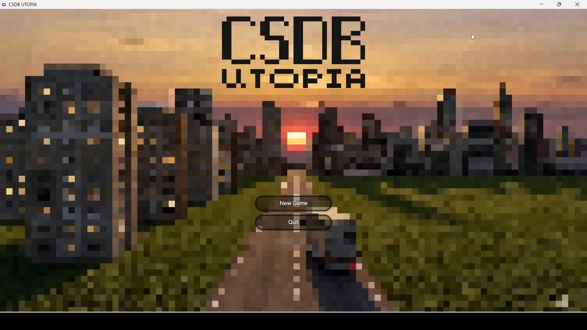
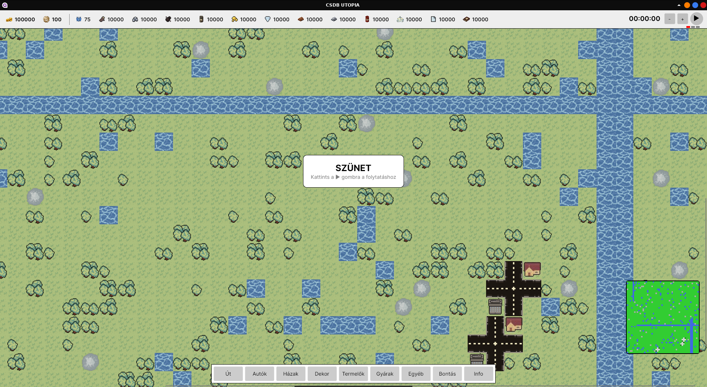
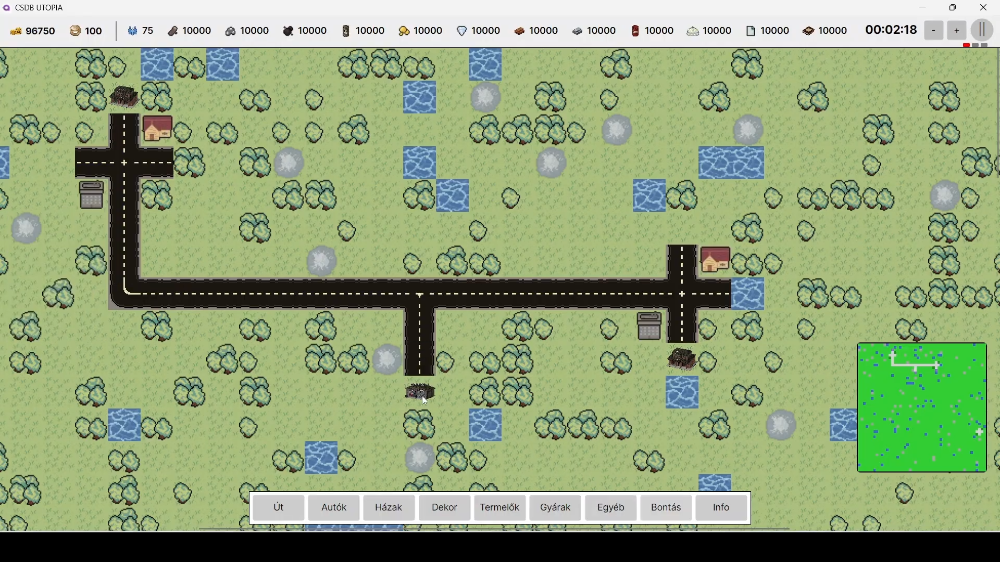
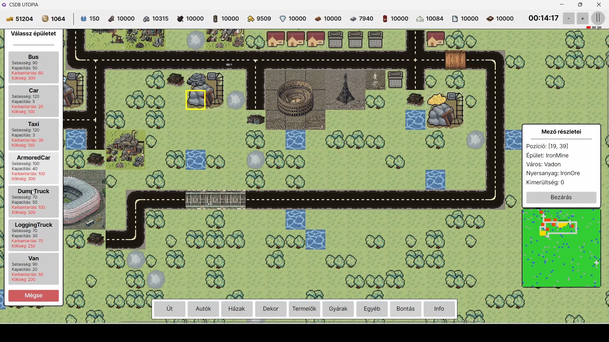

# CSDB UTOPIA

[Link a videóra](https://youtu.be/pILcQm02PFg)

<iframe width="1732" height="710" src="https://www.youtube.com/embed/pILcQm02PFg" title="CSDB Utopia | Szoftvertechnológia" frameborder="0" allow="accelerometer; autoplay; clipboard-write; encrypted-media; gyroscope; picture-in-picture; web-share" referrerpolicy="strict-origin-when-cross-origin" allowfullscreen></iframe>

## Képernyőképek

## Leírás

A CSDB Utopia egy egyszerűsített Transport Tycoon jellegű közlekedési–gazdasági szimulátor C#-ban Avalonia UI-al elkészítve. Célja, hogy a játékos városok és ipari létesítmények között közúti áruszállítást és utasszállítást szervezzen, járművek vásárlásával és útvonalak kialakításával, profit maximalizálása érdekében.
Egy két dimenziós felülnézetes térképen játszódik, amelyen városok, ipari létesítmények, az ezeket összekötő úthálózat és terepi objektumok találhatóak.A játékos utakat építhet, megállókat helyezhet el az úthálózaton, közúti járműveket vásárolhat útvonalakat definiál, és ezek segítségével árukat és/vagy utasokat szállíthat. A játék valós időben fut, de az idő múlása gyorsítható.

### Bónusz
A játékban számon tartjuk a lakosság hangulatát, amely befolyásolja a termelékenységet.  

## Irányítás

A játék egérrel, a mezőkre és az alsó menüsor gombjaira kattintással, kezelhető.

## Készítők

Szoftverfejlesztés:
 - Nagy Dávid Áron
 - Szabadi Botond
 - Zeitvogel Csaba

Grafika:
 - Nagy Dávid Áron
 - Mucsi Dóra

## Getting started

To make it easy for you to get started with GitLab, here's a list of recommended next steps.

Already a pro? Just edit this README.md and make it your own. Want to make it easy? [Use the template at the bottom](#editing-this-readme)!

